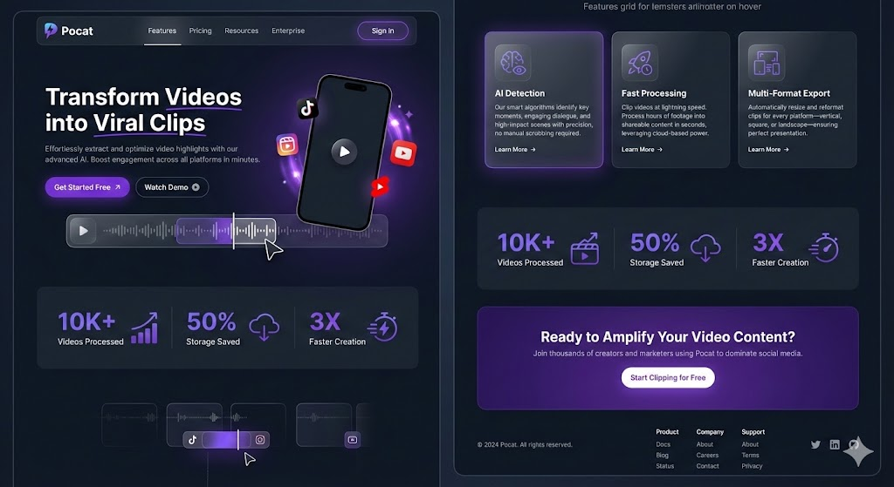
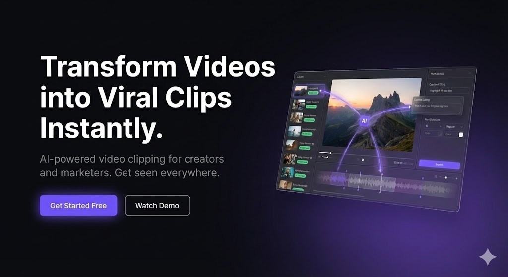

# Landing Page Implementation Plan

> Detailed plan untuk menyempurnakan landing page sesuai design references

## 📊 Analisis Design References

### Reference 01: Mobile-Centric Hero


**Visual Elements:**
- Phone Mockup - iPhone frame dengan video player
- Floating Social Icons - TikTok, YouTube, Instagram badges
- Waveform Visualization - Audio waveform dengan playhead
- Platform Selector - TikTok/IG/YT tabs di waveform
- Video Thumbnails - Grid kecil di bawah waveform
- Cursor/Pointer - Menunjukkan interaktivitas

**Feature Cards:**
- Light/white background (kontras dengan dark hero)
- Large icon boxes dengan violet background
- More detailed descriptions

### Reference 06: Desktop App Hero


**Visual Elements:**
- 3D App Window - Perspective transform dengan glassmorphism
- Glowing Light Trails - Purple/violet rays dari center
- AI Badge - "AI" label overlay di video
- 3-Column Layout - Sidebar, main video, right panel
- Waveform Timeline - Di bawah video player
- Sparkle Icon - Decorative element di corner
- Real Video Thumbnails - Bukan placeholder

---

## 🎨 Aset yang Dibutuhkan

### A. Image Assets (Generate/Download)

| Asset | Type | Size | Source |
|-------|------|------|--------|
| Phone mockup frame | PNG/SVG | 400x800px | Generate atau download |
| Sample video thumbnails (6x) | JPG | 160x90px | Stock photos |
| App screenshot | PNG | 800x500px | Screenshot dari app |
| Hero background glow | PNG | 1920x1080px | Optional (CSS alternative) |

### B. CSS-Only Assets

| Asset | Technique |
|-------|-----------|
| Waveform visualization | CSS gradients + pseudo elements |
| Glowing light trails | Radial gradients + blur filter |
| 3D perspective window | CSS transform: perspective() rotateY() |
| Floating animation | CSS @keyframes |
| Sparkle decorations | FontAwesome + absolute positioning |

### C. Icons (FontAwesome)

```
fa-brands fa-tiktok
fa-brands fa-youtube  
fa-brands fa-instagram
fa-solid fa-play
fa-solid fa-sparkles
fa-solid fa-wand-magic-sparkles
fa-solid fa-bolt
fa-solid fa-crop
```

---

## 📝 Prompts untuk Generate Assets

### Prompt 1: Phone Mockup
```
Create a modern iPhone 15 Pro mockup in portrait orientation (9:16 aspect ratio) 
with a dark video player interface inside. The screen shows a paused video with 
a centered play button. Style: minimal, dark UI, purple accent color (#7c3aed). 
Background: transparent PNG. Resolution: 400x800px.
```

### Prompt 2: Video Thumbnails
```
Generate 6 video thumbnails for a video editing app demo:
1. Podcast interview scene
2. Travel vlog sunset
3. Gaming stream highlight
4. Cooking tutorial
5. Fitness workout
6. Tech review unboxing
Style: cinematic, vibrant colors. Size: 160x90px each (16:9).
```

### Prompt 3: Hero Background Glow
```
Create an abstract background with purple/violet (#8b5cf6) glowing light rays 
emanating from center-right. Dark background (#0c0a14). Subtle, not overwhelming. 
Style: modern SaaS landing page. Size: 1920x1080px.
```

### Prompt 4: App Screenshot
```
Screenshot of a video editing dashboard with:
- Left sidebar with video thumbnails
- Center: main video player with sunset landscape
- Right panel: AI analysis options
- Bottom: audio waveform timeline
Dark theme, purple accents (#7c3aed). Modern, clean UI.
```

---

## 📋 Implementation Phases

### Phase 1: Asset Preparation
- [ ] Download/create iPhone mockup frame (SVG preferred)
- [ ] Prepare 4-6 sample video thumbnails
- [ ] Create or screenshot app interface preview
- [ ] Optional: Create hero background glow image

### Phase 2: Hero Section (Choose One)

#### Option A: Mobile-Centric (Reference 01)
```
- Phone mockup dengan video inside
- Floating social icons dengan badges
- Waveform bar dengan platform selector
- Video thumbnail grid di bawah
```

#### Option B: Desktop App (Reference 06)
```
- 3D perspective app window
- Glowing light trails dari center
- Real app interface preview
- AI badge overlay
```

#### Option C: Hybrid (Recommended)
```
- Desktop app hero (more impressive)
- Light feature cards (better contrast)
- Best of both worlds
```

#### ⭐ Option D: Planetary Smartphone (PREFERRED)
```
Konsep: Smartphone sebagai pusat dengan social media icons mengorbit seperti planet

Visual Elements:
- Smartphone mockup di tengah (portrait, 9:16)
- Video player dengan slider/playhead di dalam phone
- 6 Social media icons sebagai "planet" yang mengorbit:
  • TikTok
  • YouTube Shorts
  • Facebook
  • Instagram
  • Threads
  • YouTube

Planetary Orbit System:
- Setiap icon memiliki orbit sendiri (radius berbeda)
- Rotasi 3D - icons melewati DEPAN smartphone, lalu ke BELAKANG
- Setiap planet punya kecepatan rotasi berbeda (tidak sinkron)
- Efek depth: icon di depan lebih besar/terang, di belakang lebih kecil/redup

Interactive Parallax:
- Ketika slider/playhead digeser → icons bereaksi
- Geser ke kanan: percepat rotasi semua planet
- Geser ke kiri: perlambat/reverse rotasi
- Setiap planet bereaksi dengan kecepatan berbeda (parallax effect)
- Smooth easing untuk transisi natural

Technical Implementation:
- CSS 3D transforms: rotateY(), translateZ(), perspective()
- JavaScript: track slider position → update rotation angles
- requestAnimationFrame untuk smooth animation
- CSS custom properties untuk control rotation speed

Orbit Specifications:
┌─────────────────────────────────────┐
│           [Threads]                 │
│      ╭─────────────────╮            │
│   [FB]    ┌───────┐   [IG]          │
│      │    │ 📱    │    │            │
│      │    │ Phone │    │            │
│      │    └───────┘    │            │
│  [YT]     ╰─────────────────╯ [TikTok]│
│           [Shorts]                  │
└─────────────────────────────────────┘

Z-Index Layering:
- Icons di depan phone: z-index tinggi, scale 1.1, opacity 1
- Icons di belakang phone: z-index rendah, scale 0.8, opacity 0.5
```

### Phase 3: Feature Cards Redesign
- [ ] Change to light/white background
- [ ] Larger icon boxes (48x48px → 56x56px)
- [ ] Solid violet icon background
- [ ] Add subtle box shadow
- [ ] Increase padding (24px → 32px)
- [ ] Darker text for readability

### Phase 4: Additional Sections (Optional)
- [ ] "How It Works" - 3 step process
- [ ] Social proof / testimonials
- [ ] Pricing preview cards
- [ ] FAQ accordion

### Phase 5: Polish & Animation
- [ ] Scroll-triggered fade-in animations
- [ ] Hover effects on cards and buttons
- [ ] Smooth page transitions
- [ ] Loading skeleton states

---

## 🎯 Priority Order

1. **Hero Mockup** - Planetary Smartphone dengan orbiting social icons
2. **Feature Cards** - Light background for contrast
3. **Footer Enhancement** - Multi-column links
4. **Animations** - Polish and delight
5. **Additional Sections** - If time permits

---

## 🪐 Planetary Hero - Technical Specs

### Social Media Planets

| Platform | Icon | Orbit Radius | Rotation Speed | Start Angle |
|----------|------|--------------|----------------|-------------|
| TikTok | `fa-brands fa-tiktok` | 180px | 20s | 0° |
| YouTube Shorts | `fa-brands fa-youtube` + badge | 200px | 25s | 60° |
| Facebook | `fa-brands fa-facebook` | 160px | 18s | 120° |
| Instagram | `fa-brands fa-instagram` | 190px | 22s | 180° |
| Threads | `fa-brands fa-threads` | 170px | 24s | 240° |
| YouTube | `fa-brands fa-youtube` | 210px | 28s | 300° |

### CSS 3D Orbit Formula
```css
.planet {
  transform: 
    rotateY(calc(var(--base-angle) + var(--slider-offset) * var(--speed-multiplier)))
    translateZ(var(--orbit-radius))
    rotateY(calc(-1 * (var(--base-angle) + var(--slider-offset) * var(--speed-multiplier))));
}
```

### Parallax Multipliers
```
TikTok:    1.0x (base speed)
Shorts:    0.8x (slower)
Facebook:  1.2x (faster)
Instagram: 0.9x
Threads:   1.1x
YouTube:   0.7x (slowest)
```

### Depth Effect
```css
/* Icon di depan (rotateY ~0° atau ~360°) */
.planet.front {
  z-index: 10;
  transform: scale(1.1);
  opacity: 1;
  filter: brightness(1.1);
}

/* Icon di belakang (rotateY ~180°) */
.planet.back {
  z-index: 1;
  transform: scale(0.75);
  opacity: 0.4;
  filter: brightness(0.7) blur(1px);
}
```

---

## 🍌 Asset Generation Prompts (Google Imagen/Banana Pro)

### Asset 1: iPhone Mockup Frame (Transparent)
```
A modern iPhone 15 Pro mockup frame only, no screen content, transparent background. 
Titanium black color frame. Front view, perfectly straight, no angle. 
Clean minimal style. High resolution PNG with transparency.
The screen area should be completely transparent/empty.
```

### Asset 2: Video Player Screen Content
```
A dark video player interface screenshot for mobile app. 
Shows a paused video of a content creator speaking to camera.
Large centered play button with purple glow (#7c3aed).
Progress bar at bottom showing 30% progress.
Dark UI theme, minimal design. 9:16 portrait aspect ratio.
```

### Asset 3: TikTok Icon Badge
```
TikTok logo icon in a rounded square badge. 
Black background with white TikTok musical note logo.
Subtle shadow and 3D depth effect.
Size: 64x64 pixels. Transparent PNG background.
Modern, glossy finish.
```

### Asset 4: YouTube Shorts Icon Badge
```
YouTube Shorts logo icon in a rounded square badge.
Red background (#FF0000) with white Shorts icon (play button with vertical lines).
Subtle shadow and 3D depth effect.
Size: 64x64 pixels. Transparent PNG background.
Modern, glossy finish.
```

### Asset 5: Facebook Icon Badge
```
Facebook logo icon in a rounded square badge.
Facebook blue background (#1877F2) with white "f" logo.
Subtle shadow and 3D depth effect.
Size: 64x64 pixels. Transparent PNG background.
Modern, glossy finish.
```

### Asset 6: Instagram Icon Badge
```
Instagram logo icon in a rounded square badge.
Instagram gradient background (purple, pink, orange) with white camera outline logo.
Subtle shadow and 3D depth effect.
Size: 64x64 pixels. Transparent PNG background.
Modern, glossy finish.
```

### Asset 7: Threads Icon Badge
```
Threads (Meta) logo icon in a rounded square badge.
Black background with white Threads "@" style logo.
Subtle shadow and 3D depth effect.
Size: 64x64 pixels. Transparent PNG background.
Modern, glossy finish.
```

### Asset 8: YouTube Icon Badge
```
YouTube logo icon in a rounded square badge.
White/light background with red YouTube play button logo.
Subtle shadow and 3D depth effect.
Size: 64x64 pixels. Transparent PNG background.
Modern, glossy finish.
```

### Asset 9: Sample Video Thumbnails (Set of 6)
```
Generate 6 different video thumbnails for a video editing app demo, 16:9 landscape format:

1. "Podcast Interview" - Two people talking in professional studio setup, warm lighting
2. "Travel Vlog" - Beautiful sunset landscape, cinematic colors, adventure vibes  
3. "Gaming Highlight" - Exciting gaming moment, neon colors, energetic
4. "Cooking Tutorial" - Overhead shot of food preparation, appetizing colors
5. "Fitness Workout" - Person exercising in modern gym, motivational
6. "Tech Review" - Hands holding new smartphone/gadget, clean minimal background

Style: High quality, vibrant colors, professional look. Each 320x180 pixels.
```

### Asset 10: Hero Background Glow (Optional)
```
Abstract dark background with subtle purple/violet glow effect.
Main color: very dark purple-black (#0c0a14).
Soft glowing orbs of purple light (#8b5cf6) scattered organically.
One larger glow concentration on the right side.
Subtle grain texture overlay.
Size: 1920x1080 pixels. Modern SaaS landing page style.
```

---

## 📁 Asset File Naming Convention

Setelah generate, simpan dengan nama berikut:

```
frontend/public/assets/landing/
├── phone-frame.png          (Asset 1)
├── phone-screen.png         (Asset 2)
├── icon-tiktok.png          (Asset 3)
├── icon-shorts.png          (Asset 4)
├── icon-facebook.png        (Asset 5)
├── icon-instagram.png       (Asset 6)
├── icon-threads.png         (Asset 7)
├── icon-youtube.png         (Asset 8)
├── thumb-podcast.jpg        (Asset 9.1)
├── thumb-travel.jpg         (Asset 9.2)
├── thumb-gaming.jpg         (Asset 9.3)
├── thumb-cooking.jpg        (Asset 9.4)
├── thumb-fitness.jpg        (Asset 9.5)
├── thumb-tech.jpg           (Asset 9.6)
└── hero-glow.png            (Asset 10 - optional)
```

---

## ⚠️ Catatan Penting

1. **Transparent PNG** - Pastikan Asset 1, 3-8 punya background transparan
2. **Konsistensi ukuran** - Icon badges harus sama ukurannya (64x64)
3. **Brand colors** - Gunakan warna official dari masing-masing platform
4. **Alternatif**: Jika Imagen tidak bisa generate logo brand, gunakan:
   - FontAwesome icons (sudah tersedia)
   - Official brand asset kits
   - Simple CSS-styled badges

---

```
frontend/
├── public/
│   └── assets/
│       ├── phone-mockup.svg
│       ├── thumbnails/
│       │   ├── thumb-1.jpg
│       │   ├── thumb-2.jpg
│       │   └── ...
│       └── hero-glow.png (optional)
├── src/
│   ├── routes/
│   │   └── index.tsx (landing page)
│   └── design-system.css (landing styles)
└── docs/
    ├── design-references/
    └── LANDING_PAGE_PLAN.md (this file)
```

---

## 🔧 CSS Variables untuk Landing

```css
/* Landing-specific tokens */
--landing-hero-bg: var(--surface-base);
--landing-card-bg: #ffffff;
--landing-card-text: #1a1a2e;
--landing-card-border: #e5e5e5;
--landing-glow-color: rgba(139, 92, 246, 0.3);
```

---

## ✅ Current Status

- [x] Basic landing page structure
- [x] Header with navigation
- [x] Hero section (basic)
- [x] Stats section
- [x] Feature cards (dark)
- [x] CTA section
- [x] Footer (basic)
- [ ] Phone/App mockup
- [ ] Light feature cards
- [ ] Animations
- [ ] Additional sections

---

*Last updated: 2025-12-19*
